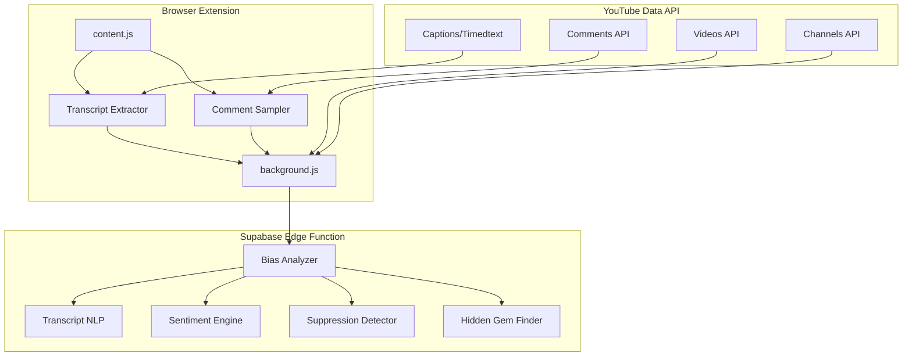
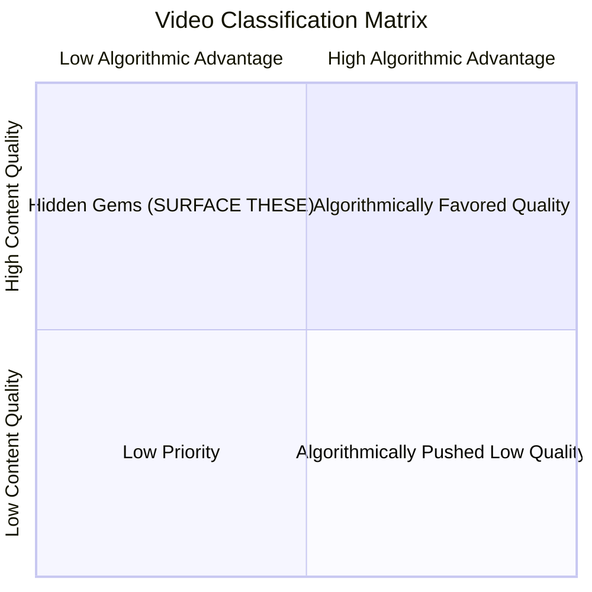

# Algorithmic Bias Detection & Hidden Gem Discovery System

## Problem Statement

Based on the research, YouTube's algorithm creates systematic biases:

- **Popularity bias**: Already-popular content gets more recommendations (rich-get-richer)
- **Engagement bias**: High CTR/watch time favored regardless of content quality
- **Format bias**: Fast-paced, sensational content favored over slow, nuanced content
- **Channel size bias**: Large creators get disproportionate algorithmic advantage

The current implementation in [background.js](extension/background.js) calculates an "Equity Score" based on subscriber count, engagement ratio, upload frequency, and video duration. However, it **doesn't analyze actual content quality** or detect suppressed high-quality videos.

---

## Architecture Overview



---

## Implementation Components

### 1. Transcript Analysis Module (HIGH PRIORITY)

**Purpose**: Extract deep content signals that YouTube's engagement metrics miss.

**Metrics to Extract**:

| Metric | How to Calculate | What It Reveals |

|--------|------------------|-----------------|

| **Speaking Pace (WPM)** | `word_count / (video_duration_seconds / 60)` | Slow (< 120 WPM) = educational/nuanced; Fast (> 180 WPM) = sensational |

| **Content Density** | Unique concepts/claims per minute | High density = informational value |

| **Source Citations** | Regex for "study", "research", "according to", URLs | Credibility indicator |

| **Clickbait Score** | Match against sensational phrases in title vs transcript | Title-content mismatch = clickbait |

| **Topic Depth** | Technical term frequency, explanation patterns | Deep vs surface-level coverage |

use gemini to analyze video descriptions and trasncipts for quality transcript

**Implementation Location**: [supabase/functions/recommend/index.ts](supabase/functions/recommend/index.ts)

```typescript
// Proposed transcript analysis function
function analyzeTranscript(transcript: string, duration: number) {
  const words = transcript.split(/\s+/).length
  const wpm = words / (duration / 60)
  
  const sourcePatterns = /\b(study|research|according to|data shows|evidence)\b/gi
  const sourceCitations = (transcript.match(sourcePatterns) || []).length
  
  const clickbaitTerms = ['shocking', 'unbelievable', 'you won\'t believe', 'insane']
  const sensationalismScore = clickbaitTerms.filter(t => 
    transcript.toLowerCase().includes(t)
  ).length
  
  return {
    wordsPerMinute: wpm,
    speakingPace: wpm < 120 ? 'slow_educational' : wpm > 180 ? 'fast_sensational' : 'moderate',
    sourceCitations,
    sensationalismScore,
    contentDensity: words / duration // words per second
  }
}
```

---

### 2. Comment Queue Analysis (MEDIUM-HIGH PRIORITY)

**Purpose**: Detect "underrated" signals and engagement quality vs quantity.

**Signals to Extract**:

| Signal | Detection Method | Meaning |

|--------|------------------|---------|

| **"Underrated" comments** | Match: "underrated", "deserves more", "why isn't this popular" | Community recognizes suppression |

| **Discussion depth** | Avg comment length, reply chains | Quality engagement vs reactions |

| **Sentiment distribution** | Positive/negative/neutral ratio | Audience satisfaction |

| **Question ratio** | Comments containing "?" | Educational engagement | Creator responds to comments ratio

**API Quota Consideration**: Comments API costs 1 unit per call. Sample top 20 comments max per video.

**Implementation**:

```typescript
async function analyzeComments(videoId: string) {
  const comments = await fetchTopComments(videoId, 20) // Limit for quota
  
  const underratedSignals = [
    'underrated', 'deserves more', 'hidden gem', 
    'why isn\'t this', 'more views', 'algorithm'
  ]
  
  let underratedCount = 0
  let totalSentiment = 0
  let avgLength = 0
  
  for (const comment of comments) {
    const text = comment.toLowerCase()
    if (underratedSignals.some(s => text.includes(s))) {
      underratedCount++
    }
    // Simple sentiment: positive words - negative words
    totalSentiment += calculateSentiment(text)
    avgLength += text.length
  }
  
  return {
    underratedSignalCount: underratedCount,
    underratedRatio: underratedCount / comments.length,
    avgCommentLength: avgLength / comments.length,
    sentimentScore: totalSentiment / comments.length,
    isHiddenGemCandidate: underratedCount >= 2
  }
}
```

---

### 3. Suppression Detection Algorithm (HIGH PRIORITY)

**Purpose**: Identify videos with high quality signals but low algorithmic exposure.

**Core Formula**:

```
Suppression Score = Quality Score - Exposure Score

Where:
- Quality Score = f(engagement_ratio, retention_proxy, source_citations, comment_quality)
- Exposure Score = f(views_vs_channel_avg, recommendation_frequency, search_ranking)
```

**Key Metrics**:

| Metric | Calculation | Threshold |

|--------|-------------|-----------|

| **Engagement-to-View Ratio** | `(likes + comments) / views * 100` | > 5% is excellent |

| **Views-to-Subscriber Ratio** | `views / subscriber_count` | < 0.1 suggests suppression |

| **Like-to-View Ratio** | `likes / views * 100` | > 4% is strong |

| **Comment Depth Ratio** | `avg_comment_length / 100` | Higher = quality discussion |

**Hidden Gem Detection**:

```typescript
function detectHiddenGem(video, channel, comments, transcript) {
  const engagementRatio = (video.likes + video.comments) / video.views * 100
  const viewsToSubsRatio = video.views / channel.subscribers
  const likeRatio = video.likes / video.views * 100
  
  const qualitySignals = {
    highEngagement: engagementRatio > 5,
    slowPace: transcript.wordsPerMinute < 140,
    hasSources: transcript.sourceCitations >= 2,
    qualityComments: comments.avgCommentLength > 50,
    underratedSignals: comments.underratedSignalCount >= 2
  }
  
  const suppressionSignals = {
    lowViews: video.views < 50000,
    smallChannel: channel.subscribers < 100000,
    lowViewsToSubs: viewsToSubsRatio < 0.1
  }
  
  const qualityScore = Object.values(qualitySignals).filter(Boolean).length
  const suppressionScore = Object.values(suppressionSignals).filter(Boolean).length
  
  return {
    isHiddenGem: qualityScore >= 3 && suppressionScore >= 2,
    qualityScore,
    suppressionScore,
    signals: { ...qualitySignals, ...suppressionSignals }
  }
}
```

---

### 4. Bias Score Calculation (Refactored)

**Current Problem**: The existing equity score in [background.js](extension/background.js) only measures "how much the algorithm favors this video" but doesn't assess content quality.

**New Approach**: Two-dimensional scoring:

1. **Algorithmic Advantage Score** (existing, refined)

   - How much YouTube's algorithm favors this content

2. **Content Quality Score** (NEW)

   - Actual content value independent of algorithmic signals

3. **Suppression Index** (NEW)

   - Gap between quality and visibility



---

### 5. Data Flow & API Design

**New Edge Function Endpoint Structure**:

```typescript
// POST /functions/v1/analyze-bias
{
  video_id: string,
  transcript?: string,  // Optional, fetched if not provided
  include_comments?: boolean  // Costs extra quota
}

// Response
{
  algorithmic_advantage: {
    score: number,      // 0-100
    breakdown: [...]    // Existing factors
  },
  content_quality: {
    score: number,      // 0-100
    speaking_pace: 'slow_educational' | 'moderate' | 'fast_sensational',
    source_citations: number,
    content_depth: number,
    clickbait_score: number
  },
  suppression_analysis: {
    is_hidden_gem: boolean,
    suppression_index: number,  // quality - visibility gap
    signals: {...}
  },
  comment_analysis?: {
    underrated_signals: number,
    sentiment: number,
    discussion_quality: number
  }
}
```

---

## Files to Modify

1. **[supabase/functions/recommend/index.ts](supabase/functions/recommend/index.ts)** - Add transcript analysis, comment analysis, suppression detection
2. **[extension/background.js](extension/background.js)** - Add transcript/comment fetching, new API calls
3. **[extension/content.js](extension/content.js)** - Update dashboard UI to show new metrics

---

## Quota Management Strategy

| API Call | Quota Cost | Strategy |

|----------|------------|----------|

| Videos | 1 | Always fetch |

| Channels | 1 | Cache 24h (existing) |

| Search | 100 | Limit discovery calls |

| Comments | 1 | Only when requested, sample 20 max |

| Captions | 0 | Free timedtext API |

**Daily Budget Allocation** (10,000 units):

- Video analysis: ~2,000 units
- Channel lookups: ~1,000 units
- Discovery searches: ~3,000 units
- Comment analysis: ~2,000 units
- Buffer: ~2,000 units

---

## Implementation Priority

| Phase | Component | Impact | Effort |

|-------|-----------|--------|--------|

| **1** | Transcript Analysis (WPM, sources, clickbait) | HIGH | Medium |

| **2** | Suppression Detection Algorithm | HIGH | Medium |

| **3** | Comment Queue Analysis | MEDIUM | Low |

| **4** | Hidden Gem Discovery Engine | HIGH | High |

| **5** | UI Updates (new metrics display) | MEDIUM | Medium |

---

## Success Metrics

1. **Detection Accuracy**: Can we identify videos that viewers call "underrated" in comments?
2. **Quality Signal Validity**: Do slow-pace, high-source videos correlate with educational value?
3. **Discovery Effectiveness**: Do surfaced "hidden gems" get positive user feedback?